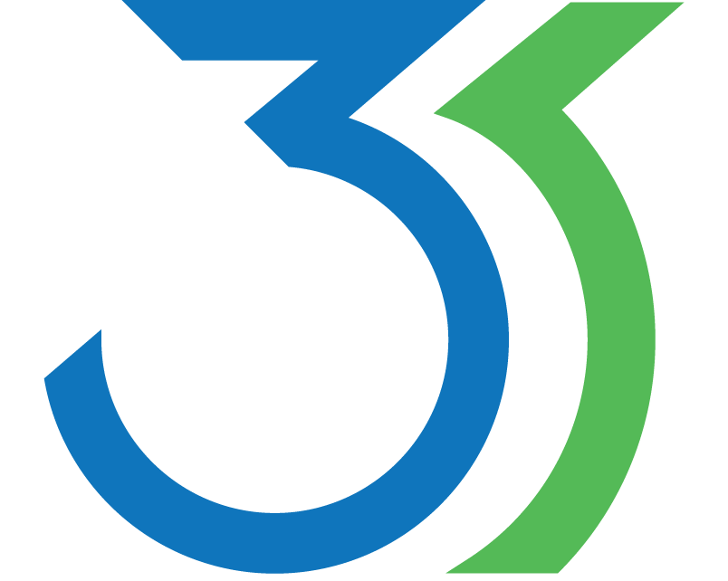

Create fun 3D contraptions that react to space, time, and physics. Bring your imagination to life in your browser at [3Scape.me](http;//3Scape.me)

This is documentation for the code that runs 3Scape.

#Installation/Setup with Node
 1. Install [Node](http://nodejs.org)
 2. Update npm: `npm update`
 3. `brew install mongo`
 4. Get DB config info from @kmcurry
 6. Run Mongo
   * might require sudo - `sudo mongod`
 7. Run 3Scape
   * from command line: `node server`
   * Look for "the magic happens on port `port`. In your browser and type in `hostname`/`port` and voila!
